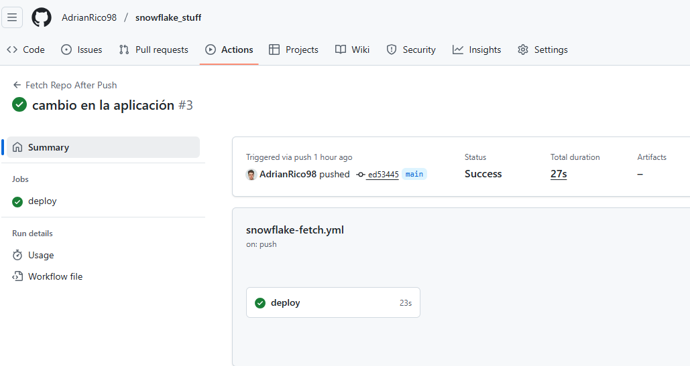

# Proyecto CI/CD: Streamlit en Snowflake con GitHub Actions

Este proyecto demuestra cómo implementar un pipeline de CI/CD completo para una aplicación Streamlit que se ejecuta en Snowflake, utilizando GitHub Actions para automatizar la sincronización del código.

## Descripción del Proyecto

El objetivo es crear un flujo automatizado donde:

1. Desarrollas tu aplicación Streamlit localmente.
2. Haces push de los cambios a GitHub.
3. GitHub Actions automáticamente sincroniza el código con Snowflake.
4. Tu aplicación Streamlit en Snowflake se actualiza automáticamente.

## Arquitectura del Sistema

```
GitHub Repository → GitHub Actions → Snowflake Git Repository → Streamlit App
```

## Configuración del Proyecto

### 1. Configuración en Snowflake

Primero, configura la integración Git en Snowflake, para ello tienes el script `git_snowflake_integration.sql`, donde configuras la integración con el secreto de developer, creas un repositorio en un stage de snowflake que se encuentra sincronizado con tu repositorio de github y creas la streamlit app asociada al archivo del repositorio.


### 2. Configuración de GitHub Actions

**Archivo:** `.github/workflows/snowflake-fetch.yml`

Esta GitHub Action se ejecuta automáticamente cada vez que hay un push a la rama `main`, sincronizando el código con Snowflake.

### 3. Secrets en GitHub

Configura estos secrets en tu repositorio de GitHub (Settings → Secrets and variables → Actions):

- `SNOWFLAKE_ACCOUNT`: Tu account identifier de Snowflake.
- `SNOWFLAKE_USER`: Tu usuario de Snowflake.
- `SNOWFLAKE_PASSWORD`: Tu contraseña de Snowflake.
- `SNOWFLAKE_ROLE`: Rol con permisos para ejecutar el FETCH.
- `SNOWFLAKE_WAREHOUSE`: Warehouse a utilizar.
- `SNOWFLAKE_DATABASE`: `PRUEBAS_ADRIAN`.
- `SNOWFLAKE_SCHEMA`: `PUBLIC`.

## La Aplicación Streamlit

La aplicación de ejemplo (`main_streamlit_demo_integration.py`) es una demo simple que muestra:
- Título y mensaje de bienvenida.
- DataFrame con datos de ejemplo.
- Mensaje de éxito.


## Flujo de Trabajo (Workflow)

1. **Desarrollo Local**: modifica tu aplicación Streamlit en una nueva rama.
2. **Commit Changes**: commitea los cambios y crea la PR
3. **Review & Merge**: se aprueba y mergea la PR.
4. **Auto-Deploy**: gitHub actions que ejecuta automáticamente el fetch en Snowflake.

## GitHub Action en Funcionamiento



*La imagen muestra la ejecución exitosa de la GitHub Action que sincroniza el código con Snowflake*

## Verificación del Deploy

Después de cada merge exitoso:

1. Ve a Snowflake → Streamlit Apps.
2. Abre `streamlit_demo_app`.
3. Verifica que los cambios se reflejen automáticamente.

## Tecnologías Utilizadas

- **Snowflake**: Data platform y hosting de Streamlit.
- **GitHub Actions**: CI/CD pipeline.
- **Streamlit**: Framework para aplicaciones de datos.
- **SnowCLI**: Herramienta de línea de comandos para Snowflake.
- **Python**: Lenguaje de programación.

## Beneficios del Proyecto

- ✅ **Automatización completa** del deployment.
- ✅ **Single source of truth** en GitHub.
- ✅ **Rollback fácil** mediante Git.
- ✅ **Colaboración mejorada** con PRs.
- ✅ **Deployment seguro** con environments.
- ✅ **Historial de cambios** completo.

## Consideraciones de Seguridad

- Los secrets de Snowflake están protegidos en GitHub.
- Se usa un environment específico (`Prod`) para mayor control.
- Token de GitHub con permisos mínimos necesarios.

